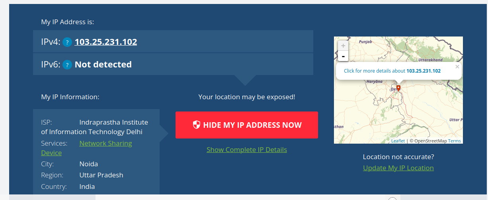

Using ifconfig:

*local/private ip address*

Using [What is my ip address](www.whatismyipaddress.com):

*global/public ip address*

Both the IP addresses are different.

The difference between the two is that the local ip address is the ip address of the device on the local network, while the global ip address is the ip address of the device on the internet. The local ip address is assigned by the router, while the global ip address is assigned by the ISP company that provides internet service to the user. This is done to reduce the number of IP addresses and abstract the IP addresses for security.
