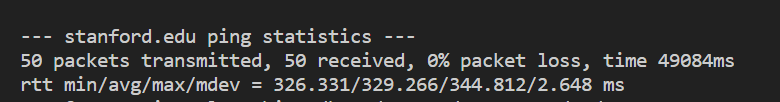

# Computer Networks Assignment 1

This is my report for the first assignment of the Computer Networks course. The report is written in markdown and can be viewed in any markdown viewer. Each individual question has its own folder with a report and any images used in the report.

## Problem 1
### Part a
Using ifconfig:

*local/private ip address*

### Part b
Using [What is my ip address](www.whatismyipaddress.com):

*global/public ip address*

Both the IP addresses are different.

The difference between the two is that the local ip address is the ip address of the device on the local network, while the global ip address is the ip address of the device on the internet. The local ip address is assigned by the router, while the global ip address is assigned by the ISP company that provides internet service to the user. This is done to reduce the number of IP addresses and abstract the IP addresses for security.

## Problem 2

### Part a
An authoritative answer is a response we get directly from the primary DNS server holding the master copy of the zone file.

To recieve an authorative answer we first must find the primary DNS server for the domain we are looking for. We can do this by using the `nslookup` command. For example, if we want to find the primary DNS server for `google.com` we can run the command `nslookup -type=soa google.com` which will return the primary DNS server for `google.com` which is `ns1.google.com`. 

Now that we have the primary DNS server for `google.com` we can run the command `nslookup google.com ns1.google.com` which will return an authorative answer for `google.com` which is in the image below:

### for part (b):

Time to live of google.com DNS is 5 seconds. It will then be 

## Problem 3

### Part a
The total hops are 10. One intermediatery router is _gateway(192.168.232.2). The average latency was is 0.506ms. The other is del11s22-in-f14.1e100.net(142.250.206.174). The average latency was 5.802ms. Rest of the routers are not shown in the output of the command `traceroute www.google.com -I`.

The output of the command `traceroute www.google.com -I` is shown below:

The below result on windows is given by the command `tracert www.google.com`:

### Part b

After pinging the URL "www.google.com" 50 times, I got an average of 9.009 ms. The exact output is shown below:

### Part c

Adding up all intermediate router latencies, we get 0.506ms + 5.802ms = 6.308ms. This is less than the average latency of pinging the URL "www.google.com" 50 times which is 9.009 ms. They are different as both traceroute and ping use different methods to calculate the latency. Traceroute uses ICMP packets to calculate the latency, while ping uses ICMP echo packets to calculate the latency.

### Part d
Maximum of all intermediate router latencies is 5.802ms. This is less than the average latency of pinging the URL "www.google.com" 50 times which is 9.009 ms. This is because the latency of any one intermediate router will be less than all the intermediate routers.

### Part e
The multiple entries in the traceroute output are due to the fact that the packets are being routed through different paths. This is because the routers are using different routing algorithms to route the packets. The routers are using different routing algorithms because they are different routers and they are using different routing algorithms to route the packets.

### Part f
The average latency is 329.266 ms. The output of the command `ping stanford.edu -c 50` is shown below:

### Part g

The number of hops to stanford.edu is 27. This is much lower than google.com's 10 hops.  The output of the command `traceroute stanford.edu -I` is shown below:

Below is the output of the command `tracert stanford.edu` on windows: 

### Part h
The latency difference between stanford.edu and google.com is 329.266 ms - 9.009 ms = 320.257 ms. This is due to stanford.edu being farther away from my location than google.com. This is because the packets have to travel a longer distance to reach stanford.edu than google.com. This is also leads to the higher number of hops to stanford.edu than google.com.

## Problem 4
To fail the localhost (127.0.0.1) with 100% packetloss, I made the firewal reject any input connection to the localhost. This can be done by running the command `sudo iptables -A INPUT 
-p icmp --icmp-type echo-request -s 127.0.0.1 -j DROP`. This will reject any input connection to the localhost. To test this I ran the command `ping 127.0.0.1` which returned the below image:

To restore the localhost I ran the command `sudo iptables -D INPUT -p icmp --icmp-type echo-request -s 127.0.0.1 -j DROP` which will remove the rule that rejects any input connection to the localhost. To test this I ran the command `ping 127.0.0.1` which returned the below image:

## Problem 5

## Problem 6

## Sources:

https://www.linode.com/docs/guides/how-to-use-nslookup-command/

https://www.baeldung.com/cs/dns-authoritative-server-ip#:~:text=An%20authoritative%20answer%20is%20a,copy%20of%20the%20zone%20file.&text=It%20gives%20us%20the%20addresses,208.238.

https://www.howtouselinux.com/post/dns-ttl#:~:text=The%20best%20way%20to%20check,is%20available%20on%20most%20systems.

https://superuser.com/questions/1137399/why-iptables-rules-are-impacting-ping-localhost

https://www.cloudservus.com/blog/using-telnet-to-send-mail

https://www.novell.com/documentation/extend5/Docs/help/Composer/books/TelnetAppendixB.html

https://www.wikihow.com/Send-Email-Using-Telnet

https://www.cloudservus.com/blog/using-telnet-to-send-mail