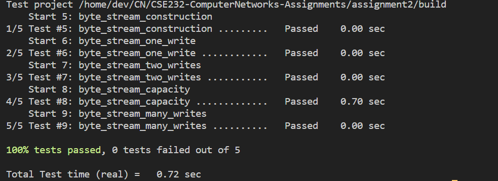
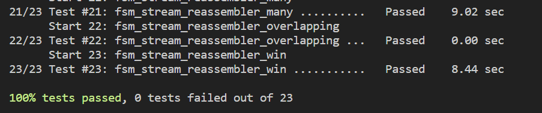

# CN Computer Networks Assignment 2

This is my report for the seond assignment of the Computer Networks course. The report is written in markdown and can be viewed in any markdown viewer. The assignment expected us to make a TCP reciever.

## Part 1
Part 1 - Required to us to implement a ByteStream class which would be used by the TCP receiver to store the incoming data. The class was implemented using a deque. The class has the following methods:

1. `ByteStream()` - Constructor for the class

2. `write(string)` - Pushes a string to the back of the deque

3. `peak_output(int)` - Returns the string stored in the deque from the front till the given index

4. `read(int)` - Returns the string stored in the deque from the front till the given index and removes it from the deque

5. `pop_output(int)` - Removes the string stored in the deque from the front till the given index

6. `buffer_empty()` - Returns true if the deque is empty

7. `size()` - Returns the size of the deque

8. `eof()` - Returns true if stream has ended

9. `bytes_written()` - Returns the number of bytes written to the stream

10. `bytes_read()` - Returns the number of bytes read from the stream

The image below shows the output of the test cases for the ByteStream class.

## Part 2 and 3
Part 2 - Required us to implement a Reassembler class which would be used by the TCP receiver to reassemble the incoming data. Then we had to implement a TCP receiver which would use the ByteStream and Reassembler class to reassemble the incoming data.

The image below shows the output of the test cases for the Reassembler class.

